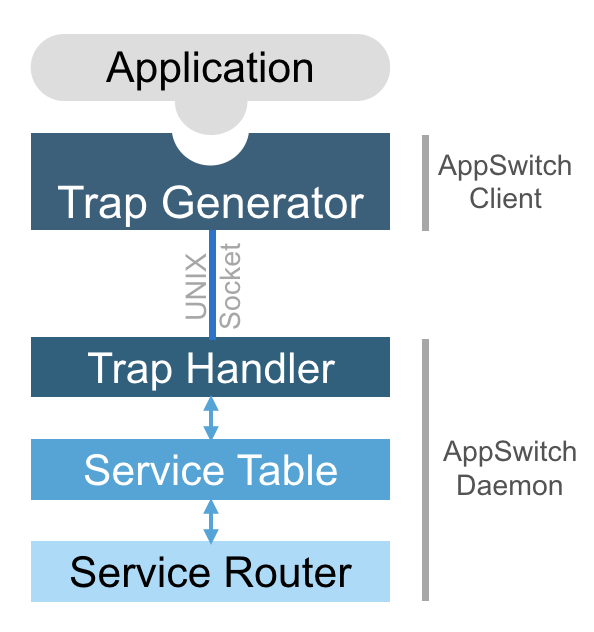
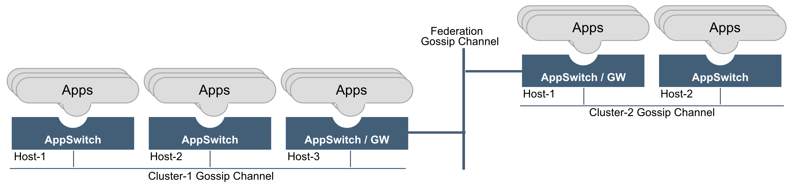

============
Architecture
============

.. _arch:

AppSwitch consists of two components, a client and a daemon.  One instance of daemon runs per host (physical / virtual machine) and exposes an interface that the client uses.  The client transparently plugs into the application and tracks the network system calls it makes such as socket(), connect(), bind(), accept() and forwards them to the daemon over a UNIX socket.  Client is not a separate process or a thread.  Rather it directly runs in the context of the application itself.  The daemon handles the system calls forwarded to it from applications based on the policy.

.. _servicetable:

Service Table
=============

AppSwitch provides a logically centralized data structure called *service table* that maintains a record of all currently running services across the cluster.  The table is automatically updated as services come and go.

When an application calls listen() system call, a new service is automatically added to the service table along with a set of system and user-defined attributes.  The service attributes include app-id, name (if specified), protocol, app-ip:app-port, host-ip:host-port and labels.

Clients running in an AppSwitch cluster would be able to access the services listed in the server table by simply connect()ing to the app-ip:app-port listed in the service table entry.  AppSwitch transparently performs service discovery, access control and traffic management based on specified policy and the contents of the service table and appropriately directs the connection.

Service Router
==============

Service router propagates the information about services as they come and go to other instances of AppSwitch daemons across hosts and clusters.  It provides flexible ingress, egress, and federation capabilities such that applications running on an AppSwitch cluster can communicate with non-AppSwitch external entities or to communicate across clusters.

.. _hierarchy:

AppSwitch Hierarchical Model
============================

AppSwitch model has the following hierarchy.  

Federation:

- Contains a set of clusters.

Cluster:

- Contains a set of nodes with mutual IP connectivity.
- A cluster may have one or more federation gateways.
- Federation gateways across clusters peer with each other over a federation gossip channel.

Node:

- Contains applications managed by AppSwitch.
- Each node runs an AppSwitch daemon instance.  Daemons across nodes peer with each other over the cluster gossip channel.

Application:

- Contains zero or more client / server sockets, maintained by the AppSwitch daemon on behalf of the application.

